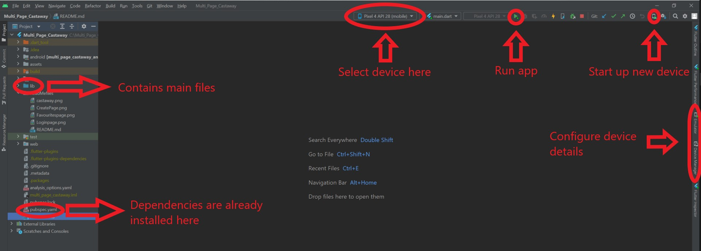

<p align="center"></p>

<h1 align="center">
  Castaway
</h1>

<h3 align="center">
  Your friendly podcast app (work in progress)
</h3>

 <br/>
 <div align="center">


</div>

## Getting Started

Castaway is a podcast app that serves contents from your favorite content creators on iPhone and Android. This project is written in Express and Firebase for the backend and Flutter for the frontend.

## Installation

### Install Flutter and Android Studio

Flutter installation guide : https://docs.flutter.dev/get-started/install

Android studio installation guide : https://developer.android.com/studio/install

### Enable HAXM

Guide for HAXM:
1. Reboot laptop and use ‘Escape’ to bring up boot menu
2. Key ‘F10’ to enter the BIOS Setup
3. Hit Tab key twice to move to ‘System Configuration’ options
4. Ensure that the ‘Virtualization Technology’ checkbox is checked
5. Press F10 to Save and Exit

### Create a virtual android/ios emulator

Emulator guide: https://developer.android.com/studio/run/managing-avds

### Clone this repository

```bash
## using ssh
git clone git@github.com:yyj-02/castaway-frontend.git

##using https
git clone https://github.com/yyj-02/castaway-frontend.git
```

### Open cloned repository in Android studio

Guide: https://docs.flutter.dev/development/tools/android-studio

### Install dependencies
In your terminal

```bash
## Confirm flutter installation and version
flutter doctor

##Get all dependencies
flutter pub get

##Upgrade all dependenceies to latest verison
flutter pub upgrade
```
### Select your virtual machine 
Select your android virtual machine from the drop down menu on the toolbar
<br>
(Refer to Installation appendix)

### Run the program
Press the green play button to run the flutter program.
<br>
(Refer to Installation appendix)

### Possible errors and solutions
<ul>
  <li> OS error number 5: Disable your antivirus software e.g norton/windows defender</li>
  </ul>
<h3> Installation appendix</h3>
<p align="center"></p>

### Note
<ul>
  <li> Livestream is currently down due to cost considerations. However if you would like to test it out locally you may run the docker container which can be found
  in the backend documentation under media server.Then comment out the variable add in both live.dart and Livestream.dart and uncomment the line below it.</li>
  </ul>

## Frontend Documentation

[go to Further documentation →](./ReadMefiles/README.md)

## Backend Documentation

[go to backend documentation →](https://github.com/yyj-02/castaway-backend#readme)
