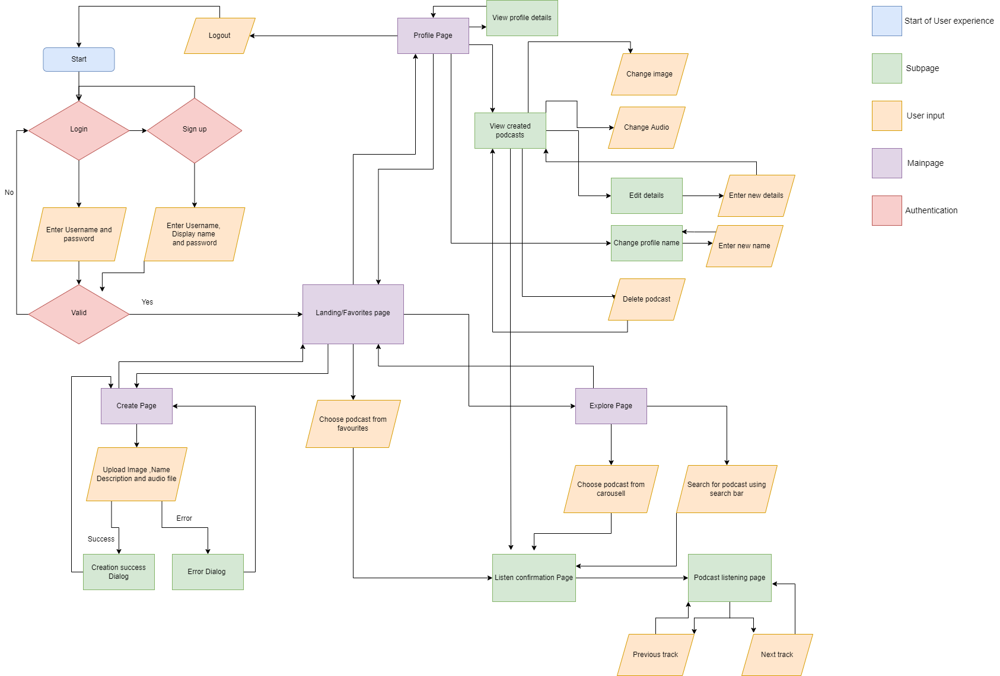

<h1>
  Castaway Frontend Documentation
</h1>
<h2> Overview</h2>

 Castaway is a podcast streaming app whose frontend is built with flutter which provides and intuitive and straighforward programming framework.
  You can use this app to stream your favourite podcast and listen to them at any time. The app also allows you to create your own podcasts with audio recordings
  or go live(work in progress).

<h2> Design considerations</h2>

 <b>Our first consideration</b> was to figure out how to stand out from other applications currently on the market. This led us to adopting a minimalist design for
our user interface. We believe that this will give us the edge over current competitors,
  
  <b>Our next consideration</b> was figuring out how to incorporate strong visuals. In this aspect we have adopted the approach of "If it's not great leave it out". Our mockup will give you a rough idea of the strong imagery we intend to impement in our app over the coming days.
    
  <b>Our last consideration</b> was to be obvious which ties in with our minimalist ethos. We have taken extra precautions in terms of UX design to ensure a confusion free experience for the user. To allow for this all of our components refresh as necessary to provide you with up to date podcasts and podcast details.

<h2> App preview Images</h2>

<h2> User Flow Diagram <h2>

 ## Components and API used
  [go to API documentation →](https://github.com/yyj-02/castaway-backend/blob/main/functions/README.md)
   
  ### Hot reload feature
  #### Description
  #### API used
 
  ### Login Page
  #### Description
  #### API used
  
  ### Sign up Page
  #### Description
  #### API used
  <ul>
    <li>API used</li>
    <li>API used</li>
    <li>API used</li>
  </ul>
  ### Favourites page
  #### Description
  #### API used
  <ul>
    <li>API used</li>
    <li>API used</li>
    <li>API used</li>
  </ul>
  ### Create page
  #### Description
  #### API used
  <ul>
    <li>API used</li>
    <li>API used</li>
    <li>API used</li>
  </ul>
  ### Explore page
   #### Description
  #### API used
  <ul>
    <li>API used</li>
    <li>API used</li>
    <li>API used</li>
  </ul>
  ### Preview page
  #### Description
  #### API used
  <ul>
    <li>API used</li>
    <li>API used</li>
    <li>API used</li>
  </ul>
  ### Podcast view page
  #### Description
  #### API used
  <ul>
    <li>API used</li>
    <li>API used</li>
    <li>API used</li>
  </ul>
  ### Profile page
  #### Description
  #### API used
  <ul>
    <li>API used</li>
    <li>API used</li>
    <li>API used</li>
  </ul>
  ### View profile page
  #### Description
  #### API used
  <ul>
    <li>API used</li>
    <li>API used</li>
    <li>API used</li>
  </ul>
  ### View creations page
  #### Description
  #### API used
  <ul>
    <li>API used</li>
    <li>API used</li>
    <li>API used</li>
  </ul>
  ### Change name page
  #### Description
  #### API used
  <ul>
    <li>API used</li>
    <li>API used</li>
    <li>API used</li>
  </ul>
  [go to API documentation →](https://github.com/yyj-02/castaway-backend/blob/main/functions/README.md)
  
