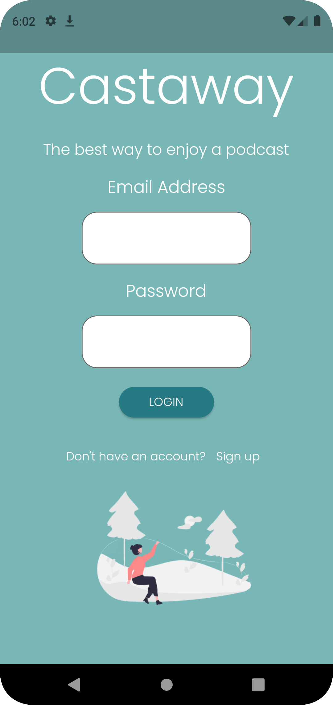
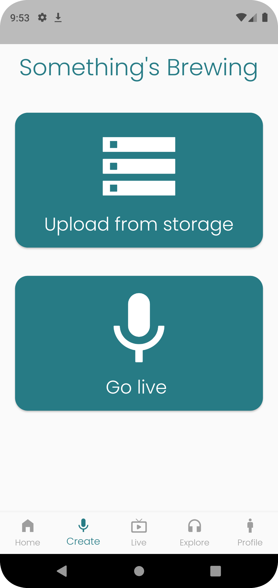
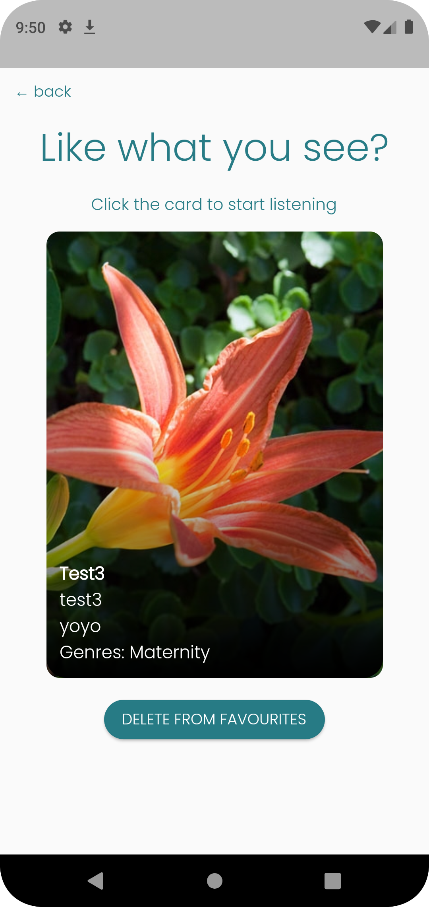
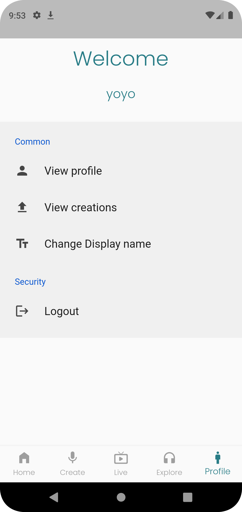

<h1>
  Castaway Frontend Documentation
</h1>
<h2> Overview</h2>

 Castaway is a podcast streaming app whose frontend is built with flutter which provides and intuitive and straighforward programming framework.
  You can use this app to stream your favourite podcast and listen to them at any time. The app also allows you to create your own podcasts with audio recordings
  or go live(work in progress).

<h2> Design considerations</h2>

 <b>Our first consideration</b> was to figure out how to stand out from other applications currently on the market. This led us to adopting a minimalist design for
our user interface. We believe that this will give us the edge over current competitors,
  
  <b>Our next consideration</b> was figuring out how to incorporate strong visuals. In this aspect we have adopted the approach of "If it's not great leave it out". Our mockup will give you a rough idea of the strong imagery we intend to impement in our app over the coming days.
    
  <b>Our last consideration</b> was to be obvious which ties in with our minimalist ethos. We have taken extra precautions in terms of UX design to ensure a confusion free experience for the user. To allow for this all of our components refresh as necessary to provide you with up to date podcasts and podcast details.

<h2> App preview Images</h2>

<h2> User Flow Diagram </h2>

 ## Components and API used
   
  

  
<h3 style="display: inline;">In app Hot reload</h3>
 
  <h4>Description</h4>
  
 A combination of API calls used to ensure that information updated on the app is displayed instantly. The collection of these API calls will be refered to as hot reload feature in the further parts of this documentation 

  <h4>API called</h4>
  <ul>
    <li>Get all podcasts</li>
    <li>View favourites</li>
    <li>View creations</li>
  </ul>
    

    
  

  
<h3 style="display: inline;">Login page</h3>

  

  <h4>Description</h4>
  
 A simple login page which authenticates the user and loads up their information and necessary streaming data. 

  <h4>API called</h4>
  <ul>
    <li>Log into an account</li>
    <li>View Profile</li>
    <li>Hot reload feature</li>
  </ul>
    

    
 

  
<h3 style="display: inline;">Sign up page</h3>
 
  

  <h4>Description</h4>
  
 A simple sign up page which creates an account, authenticates the user and loads up their information and necessary streaming data. 

  <h4>API called</h4>
  <ul>
    <li>Create an account</li>
    <li>View Profile</li>
    <li>Hot reload feature</li>
  </ul>
    

  
<h3 style="display: inline;">Favorites page</h3>
 
  

  <h4>Description</h4>
  
 A simple page that displays all the podcasts that have been marked as favourite but the user with the option to preview them 

  <h4>API called</h4>
  <ul>
    <li>None</li>
  </ul>
    

    
  

  
<h3 style="display: inline;">Create page</h3>
 
  

  <h4>Description</h4>
  
 A simple page which allows users to create their podcasts from a recorded source or go live. 

  <h4>API called</h4>
  <ul>
    <li>None</li>
  </ul>
    

    
  

  
<h3 style="display: inline;">Create from Storage</h3>
 
  

  <h4>Description</h4>
  
 This page allows users to upload their podcast image, audio file, title, description and genres and create a podcast. The podcast is hot reloaded onto the users page and will be loaded for all other users when a reload is triggered. This happens every hour automatically 

  <h4>API called</h4>
  <ul>
    <li>Upload Audio file</li>
    <li>Upload Image file</li>
    <li> Create Podcast</li>
    <li> Delete Audio file</li>
    <li> Delete Image file</li>
    <li>Hot reload feature</li>
  </ul>
    

    
  

  
<h3 style="display: inline;">Explore Page</h3>

  

  <h4>Description</h4>
  
 This page allows users to view podcasts uploaded by all users 

  <h4>API called</h4>
  <ul>
    <li>None</li>
  </ul>
    

    
  

  
<h3 style="display: inline;">Preview Page</h3>
 
  
        

  <h4>Description</h4>
  
 This page allows users to preview podcasts uploaded by all users before going in to listen to them 

  <h4>API called</h4>
  <ul>
    <li>Add to favorites (parent explore)</li>
    <li>Delete from favorites (parent favourites)</li>
    <li>Update podcast image file (parent view creations)</li>
    <li>Update podcast audio file (parent view creations)</li>
    <li>Update podcast details (parent view creations)</li>
    <li>Delete podcast (parent view creations)</li>
  </ul>
    

    
  

  
<h3 style="display: inline;">Podcast view Page</h3>
 
   

  <h4>Description</h4>
  
 This page allows users to listen to podcasts uploaded by other users 

  <h4>API called</h4>
  <ul>
    <li>Stream Podcast</li>
  </ul>
    

    
  

  
<h3 style="display: inline;">Profile Page</h3>
 
   

  <h4>Description</h4>
  
 This simple menu page allows users to view their personal profile and settings 

  <h4>API called</h4>
  <ul>
    <li>None</li>
  </ul>
    

    
   

  
<h3 style="display: inline;">View Profile Page</h3>
 
   

  <h4>Description</h4>
  
 This simple page displays users personal information 

  <h4>API called</h4>
  <ul>
    <li>None</li>
  </ul>
    

    
 

  
<h3 style="display: inline;">View Creations Page</h3>
 
  

  <h4>Description</h4>
  
 This simple page displays podcasts created by the user 

  <h4>API called</h4>
  <ul>
    <li>None</li>
  </ul>
    

    
  

  
<h3 style="display: inline;">Change name Page</h3>
 
  

  <h4>Description</h4>
  
 This simple page allowing users to change their display name 

  <h4>API called</h4>
  <ul>
    <li>Change display name</li>
  </ul>
    

    
  [go to API documentation →](https://github.com/yyj-02/castaway-backend/blob/main/functions/README.md)
